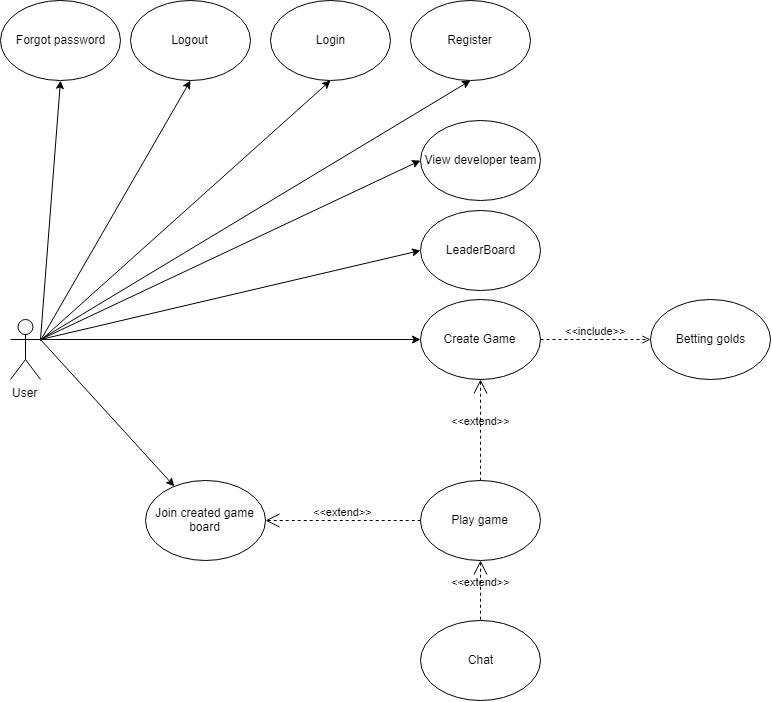

# Thathu caro 
  - [Thathu caro](#thathu-caro)     
  - [Features](#features)     
  - [UseCase](#usecase)     
    - [Game constraints](#game-constraints)         
    - [Registry](#registry)         
    - [Create game board/ betting golds](#create-game-board-betting-golds)         
    - [Join game board](#join-game-board)         
    - [Playing game](#playing-game)         
    - [Chat when playing](#chat-when-playing)     
  - [REST API](#rest-api)         
    - [Register](#register)         
    - [Logout](#logout)         
    - [Login](#login)         
    - [Forgot password](#forgot-password)         
    - [Ranking](#ranking)         
    - [Create game](#create-game)         
    - [Get List Waiting game](#get-list-waiting-game)         
    - [Join Waiting game](#join-waiting-game)     
  - [Socket](#socket)         
    - [socket event(opponent_out_game)](#socket-eventopponent_out_game)         
    - [socket event(message_come)](#socket-eventmessage_come)         
    - [socket event(ready_to_start_game)](#socket-eventready_to_start_game)         
    - [socket event(start_game)](#socket-eventstart_game)         
    - [socket event(next_turn)](#socket-eventnext_turn)         
    - [socket event(end_game_and_play_new_game)](#socket-eventend_game_and_play_new_game)         
    - [socket event(opponent_get_out_of_game)](#socket-eventopponent_get_out_of_game)        
    - [socket event(chat)](#socket-eventchat)        
    - [socket event(play_time_out)](#socket-eventplay_time_out)         
    - [socket event(accept_to_play_new_game)](#socket-eventaccept_to_play_new_game)         
    - [socket event(get_out_of_game)](#socket-eventget_out_of_game)  

## Features

- Register
- Login
- Logout
- Forgot password
- View developer team
- Create game board
- Join created game board
- Play game between two users
- Leaderboard
- Betting golds
- Chat when playing


## UseCase



## Game constraints

### Registry

- username is unique
- email is unique
- each new user has 10.000 golds.


### Create game board/ betting golds

- Standard 15x15 grid.
- Current user must has logged in.
- Golds of current user must greater or equal than the betting golds of game board.
- An unique id will be auto created for current game board.

### Join game board

- Current user must has logged in.
- Current user golds must greater or equal than the betting golds of the game board.

### Playing game

- Game board will random who be the first, host (X) or opponent (O).
- Each time turn is limited with 20 seconds, if user do not play their turn, then that user lost.
- Winning state of user:
  - Not blocking in two heads
  - Exactly 5 patterns in 

### Chat when playing

- Chat with characters and emojis.

## REST API

### Register

POST /register

Request

```
body:{
	username: “a”,
	password: “b”
}
```

Response

```sh
Code 201: Created register succes
Code 400: Bad Request invalid username or password
Code 409: Conflict user exist
Code: 500:  Internal Server Error
```
### Logout

POST /logout

Request

```sh
body:{
	token: “token”
}
```

Response

```sh
Code 400: Bad Request invalid token
Code: 500: Internal Server Error
```

### Login

POST /login

Request
```sh
body:{
	username: “a”,
	password: “b”
}
```

Response
```sh

Code 200: ok Login success

boody:{
	user: user,
	token: token
}
Code 400:  Bad Request invalid username or password

Code 409:  Conflict user loged

Code: 401: wrong username or password
```
### Forgot password

POST /forgotpassword

Request
```sh
body:{
	email: “email”,
	username: username
}
```

Response

```sh
Code 200: OK 

Code: 401: wrong username or email
```

### Ranking

GET /ranking

Request
`
header authorization: bearer token
`

Response

```sh
Code 200: OK
body:{
	user: []
}
Code 401: UNAUTHORIZED  wrong token
```

### Create game

POST /games

Request
`
header authorization: bearer token
`

```sh
body:{
	betting-gold: 2000
}
```

Response

```sh
Code 200:  OK
Code 500: Internal Server Error
Code 401: Unauthorized wrong token
```

### Get List Waiting game
GET /games

Request

`
header authorization: bearer token
`

Response

```sh
Code 200:  OK

Code 500: Internal Server Error

Code 401: Unauthorized wrong token
```

### Join Waiting game

GET /games/join

Request
`
header authorization: bearer token
`

Response
```sh
Code 200: OK

Code 500: Internal Server Error

Code 401: Unauthorized wrong token
```

## Socket


`socket event(opponent_join_game)`: to inform that a competitor has entered the game.
Response from server

```sh
    clientSocket.emit('opponent_join_game',{
        gameId:data.gameId,
        opponentId:data.userId,
        opponentName:data.username,
        opponentGolds:data.golds,
        opponentTotalPlayedGame:data.totalPlayedGame
    });
```

### socket event(opponent_out_game)

`socket event(opponent_out_game)`: to inform that a competitor has outed the game.

Response from server

```sh
    clientSocket.emit('opponent_out_game',{
        gameId:idGameCount,
        bettingGolds:bettingGolds,
        bonusGolds:1000,
        opponent:null
    });
```

### socket event(message_come)

`socket event(message_come)`: to inform that a new message come from competior.

Response from server

```sh
    io.sockets.in('chat' + data.gameId).emit('message_come', {
        message: data.message,
        time: data.time,
        userIdSend: data.userId
    })
```

### socket event(ready_to_start_game)

`socket event(ready_to_start_game)`: Inform the client that the player is ready to play a new game.

Response from server

```sh
    io.of('/').connected[client]
    .emit('ready_to_start_game',data.gameId);
```

### socket event(start_game)

`socket event(start_game)`: Inform the client that the game is started.

Response from server

```sh
{
    firstUserId: roomGame.opponent_id,
    patterns: [
        {
            patternType: 'X',
            userId: roomGame.opponent_id
        },
        {
            patternType: 'O',
            userId: roomGame.host_id
        }
    ]
}
```

### socket event(next_turn)

`socket event(next_turn)`: The player who receives the notification from the server is his next turn.

Response from server

```sh
    clientSocket.emit('next_turn',{
        gameId:data.gameId,
        y:data.y,
        x:data.x,
        pattern:data.pattern
    });
```

### socket event(end_game_and_play_new_game)

`socket event(end_game_and_play_new_game)`: The server informs the end of the game, can continue or exit.

Response from server

```sh
    io.to('' + data.gameId)
    .emit('end_game_and_play_new_game', [
        {
            type: 'OLD_GAME',
            gameId: data.gameId,
            betting_golds: roomGame.betting_golds,
            winner: null,
            loser: null,
        },
        {   
            type: 'NEW_GAME',
            gameId: idGameCount,
            hostId: roomGame.host_id,
            opponent: roomGame.opponent_id
        }
    ]);
```

### socket event(opponent_get_out_of_game)

`socket event(opponent_get_out_of_game)`: The server informs you that your opponent exited the game while playing, and you are the winner.

Response from server

```sh
    socket.emit('opponent_get_out_of_game',data.gameId);
```

### socket event(chat)

`socket event('chat')`: Player send messages to opponents in the same game

Request from client

```sh
    socket.emit('chat', {
        message: "hello",
        userId: 1,
        time: "10:10:10",
        gameId: 1
    });
```

### socket event(play_time_out)

`socket event(play_time_out)`: When the timer expires, send a losing signal to the server.

Request from client

```sh
    socket.emit('play_time_out', {
        gameId: 1,
        userId: 1
    });
```

### socket event(accept_to_play_new_game)
`socket event(accept_to_play_new_game)`: When the game has results, the player wants to continue playing the game

Request from client

```sh
    socket.emit('accept_to_play_new_game',{
        gameId:1,
        userId:1,
        accept:"false"
    });
```

### socket event(get_out_of_game)
`socket event(get_out_of_game)`: send a signal to the server when the player is in the game and exit the game

Request from client

```sh
    socket.emit('get_out_of_game', {
        gameId: 1,
        userId: 1
    })
```
